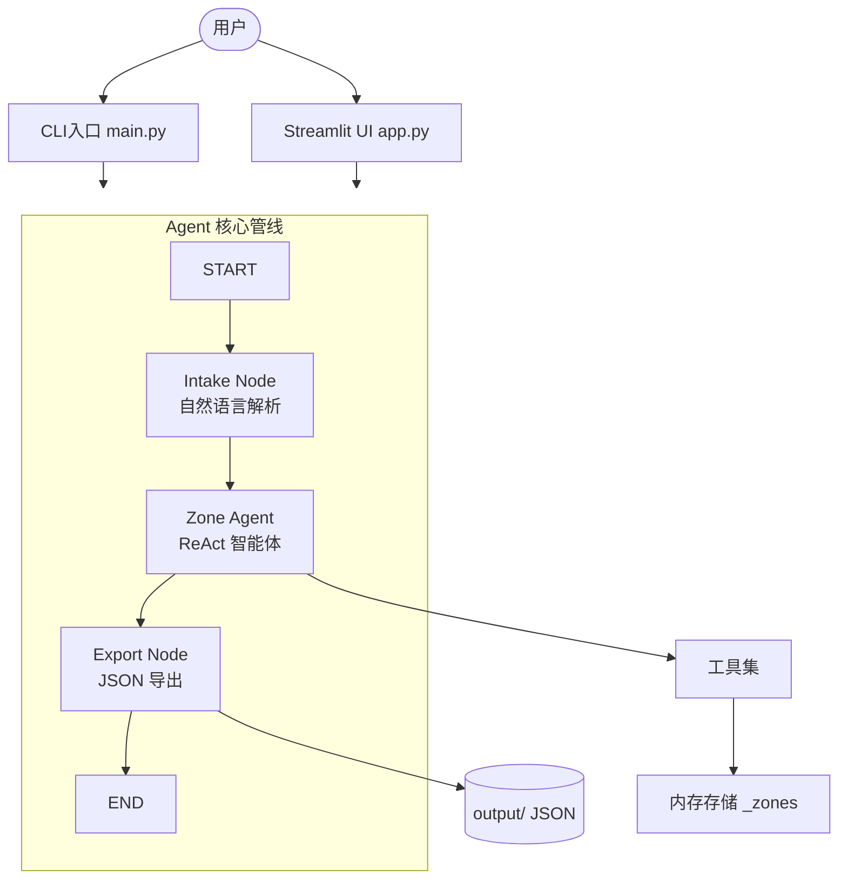
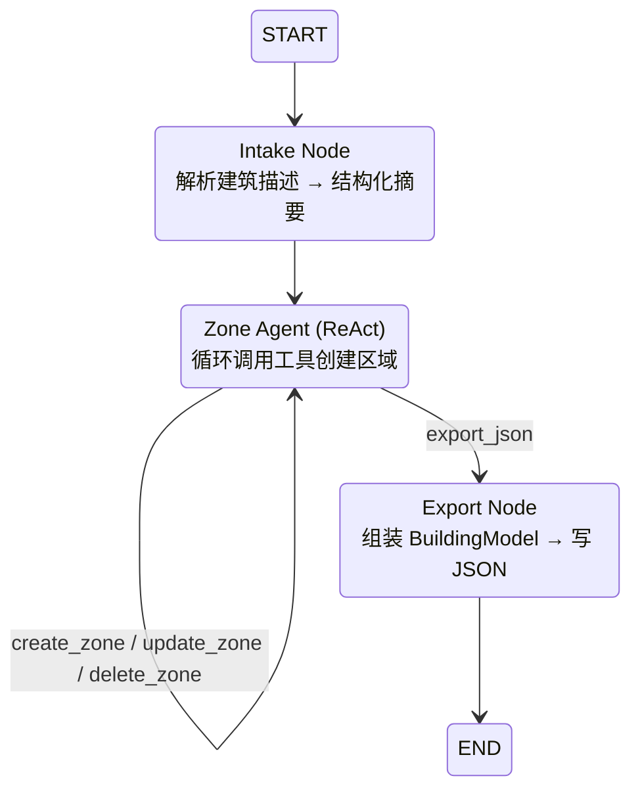
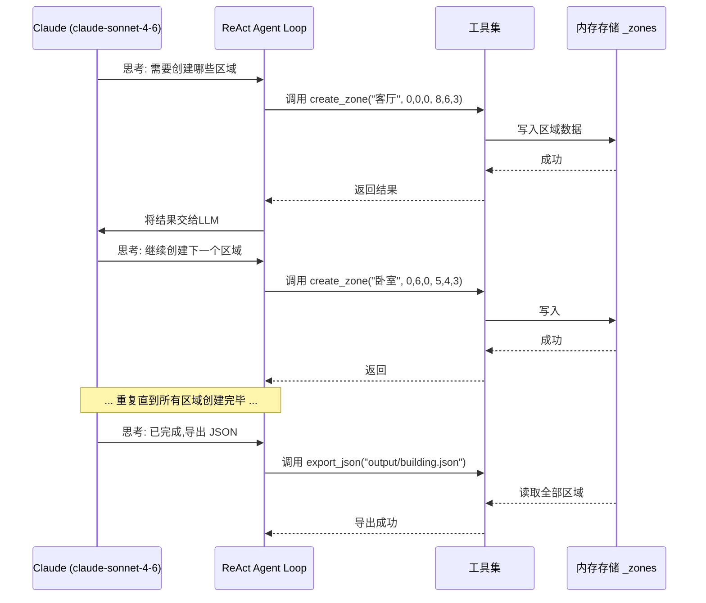
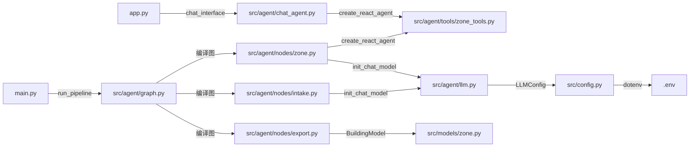
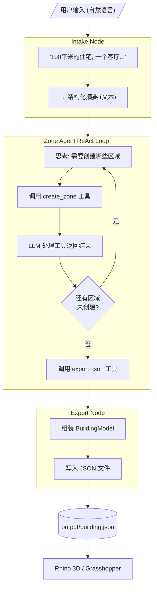

# 项目 Agent 框架图

## 1. 整体架构



## 2. LangGraph 工作流



## 3. Zone Agent 内部机制 (ReAct)



## 4. 模块依赖关系

```mermaid
graph LR
    subgraph Config [配置层]
        config.py
    end

    subgraph Models [数据模型层]
        zone.py[zone.py<br/>Point3D / Dimensions / Zone / BuildingModel]
    end

    subgraph Agent [Agent 逻辑层]
        graph.py[graph.py<br/>LangGraph 编排]
        state.py[state.py<br/>AgentState 类型定义]
        llm.py[llm.py<br/>LLM 工厂]
        chat_agent.py[chat_agent.py<br/>多轮对话 ReAct]
        nodes/intake.py[intake.py<br/>NL → 结构化摘要]
        nodes/zone.py[zone.py<br/>ReAct 智能体节点]
        nodes/export.py[export.py<br/>JSON 输出节点]
    end

    subgraph Tools [工具层]
        zone_tools.py[zone_tools.py<br/>create_zone / list_zones<br/>update_zone / delete_zone<br/>export_json]
    end

    Agent --> Models
    Agent --> Config
    Tools --> Models
    nodes/zone.py --> Tools
    graph.py --> nodes/intake.py
    graph.py --> nodes/zone.py
    graph.py --> nodes/export.py
```

## 5. 文件调用流程



## 6. 核心数据流



## 7. 层次总览

| 层次 | 组件 | 职责 |
|------|------|------|
| **入口层** | `main.py`, `app.py` | CLI 和 Streamlit UI |
| **编排层** | `graph.py` | LangGraph 三节点工作流编排 |
| **Agent 层** | `zone.py`, `chat_agent.py` | ReAct 智能体, 通过思考-行动循环创建建筑区域 |
| **工具层** | `zone_tools.py` | 5 个 LangChain 工具 (create_zone / list_zones / update_zone / delete_zone / export_json) |
| **数据模型** | `zone.py` | Pydantic 模型: Point3D, Dimensions, Zone, BuildingModel |
| **配置层** | `config.py`, `.env` | LLM 提供商 / 模型 / 参数配置 |
| **输出层** | `output/*.json` | Rhino/Grasshopper 可直接读取的结构化 JSON |
